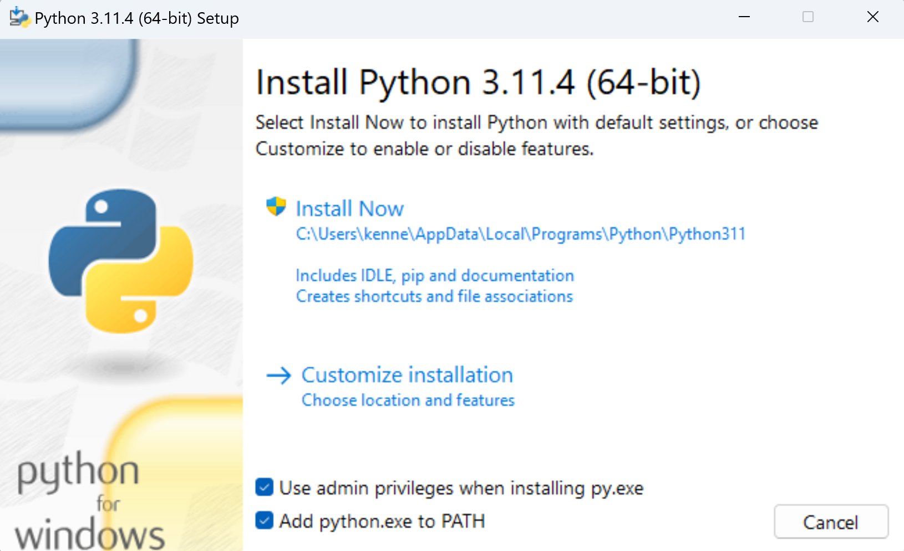

# How to install and run Python on Windows
Full indepth instructions can be found [here](https://docs.python.org/3/using/windows.html)

## Important Locations

| Item                | Value                                                 |
| ------------------- | ----------------------------------------------------- |
| Python Windows Docs | https://docs.python.org/3/using/windows.html          |
| Install Directory   | *%LOCALAPPDATA%\Programs\Python\Python311*            |
| Executable          | *%LOCALAPPDATA%\Programs\Python\Python311\python.exe* |
| Scripts Dir         | *%LOCALAPPDATA%\Programs\Python\Python311\Scripts*    |
| Pacakge Dir         | *%LOCALAPPDATA%\Programs\Python\Python311\Lib*        |

## Important Command

| Item                 | Value              |
| -------------------- | ------------------ |
| Find Python location | ```where python``` |
| List installed Packages| ```pip list```   |
| Install Package | ```pip install jupyter |


## Checking existing installs
Before starting an install it is worth checking if you have any version of Python already installed. We do this by running the following from a CMD prompt 

**Note:** this did not work from the VS Code terminal for me. In VS Code I got nothing back.

```
where python
```

On my machine I see

* C:\Python310\python.exe
* %LOCALAPPDATA%\Programs\Python\Python311\python.exe
* %LOCALAPPDATA%\\Microsoft\WindowsApps\python.exe

I uninstalled all apps and made sure there were no python related directories in the environment *PATH* (or any other python related environment variables). I could not however delete the following

```C:\Users\kenne\AppData\Local\Microsoft\WindowsApps\python.exe```


## Installing
The [python documentation](https://docs.python.org/3/using/windows.html) states 

> The [full installer](https://docs.python.org/3/using/windows.html#windows-full) contains all components and is the best option for developers using Python for any kind of project.

So we use that one. Note I have ticked *Add python.exe to PATH* and by default it will install to 

 * *%LOCALAPPDATA%\Programs\Python\Python311*



Now when I run 

```
where python 
```

I see 

* %LOCALAPPDATA%\Programs\Python\Python311\python.exe
* %LOCALAPPDATA%\\Microsoft\WindowsApps\python.exe

If I run 

```python --version``` I see **Python 3.11.4**

The install adds the following to the users PATH 

* %LOCALAPPDATA%\Programs\Python\Python311\
* %LOCALAPPDATA%\Programs\Python\Python311\Scripts

By adding the Scripts folder we can access the **pip** executable which is the python package installer. 


